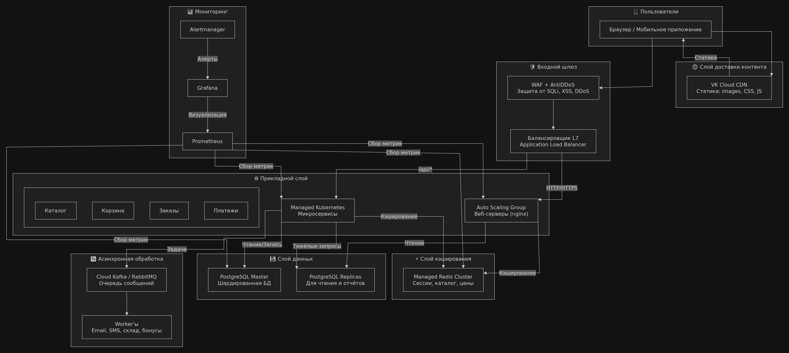

# README итогового проекта

## 1. Цель проекта

Развернуть отказоустойчивую инфраструктуру для веб‑приложения (сайт‑резюме), упакованного в Docker‑образ, с использованием виртуальных машин, балансировщика нагрузки и управляемой базы данных (PostgreSQL) в облаке VK Cloud. Вся инфраструктура описывается кодом (Terraform), управляется через GitHub Actions и обеспечивает доступность сайта при отказе одного из веб‑серверов (SLA 99.9%).

## 2. Выбранный вариант и почему он выбран

**Выбран вариант №1 из Документа 9** – *«Отказоустойчивый веб‑хостинг на ВМ»*, но с заменой ручного Nginx на Docker‑контейнер с собственным приложением.

**Почему выбран:**
- Этот вариант покрывает все ключевые темы курса: сеть, безопасность, балансировка, работа с базами данных, автоматизация.
- Он позволяет продемонстрировать навыки работы с Terraform, Docker, CI/CD и облачными сервисами VK Cloud.
- Стек соответствует реальным задачам промышленной эксплуатации.
- Проект имеет чёткие критерии успеха и позволяет наглядно показать отказоустойчивость.

## 3. Архитектура

### Схема



*Схема создана в draw.io и отражает все компоненты инфраструктуры.*

### Основные компоненты

- **Виртуальные машины**:
  - **2 веб‑сервера** (flavor `Basic-1-1-10`) в приватной подсети – на каждом запущен Docker‑контейнер с приложением (образ из приватного реестра).
  - **Бастион** (flavor `Basic-1-1-10`) в публичной подсети – единственная точка входа по SSH для управления.
- **Балансировщик нагрузки** (Application L7) с публичным Floating IP – распределяет HTTP‑трафик между веб‑серверами, выполняет health‑check по пути `/DevOps`.
- **Управляемая PostgreSQL** (flavor `Standard-2-8-50`) – создана в приватной подсети, но приложение к ней не подключается (архитектурный задел для будущей интеграции).

### Сетевой контур

- **VPC** с двумя подсетями:
  - **public** (192.168.1.0/24) – для балансировщика и бастиона.
  - **private** (192.168.2.0/24) – для веб‑серверов и БД.
- Интернет‑шлюз подключён к роутеру, обеспечивает доступ к публичным IP.
- Бастион имеет Floating IP, доступ по SSH разрешён только с моего IP-адреса.

### Безопасность

- **Security Groups**:
  - `main` – разрешает HTTP (80) для всех, SSH (22) только с моего IP, исходящий трафик разрешён.
  - `db_sg` – разрешает доступ к PostgreSQL (5432) только из приватной подсети.
- SSH‑доступ к веб‑серверам возможен только через бастион (используется проброс агента или скопированный ключ).
- Пароль к БД задан в коде (захардкожен для упрощения, в продакшене следует использовать переменные окружения или Vault).

### Мониторинг

- Health‑check балансировщика по HTTP `/DevOps` – проверяет доступность приложения.
- Нагрузочное тестирование с `ab` подтверждает стабильность (99.9% успешных запросов).

### Управление затратами

- Использованы минимальные флейворы `Basic-1-1-10` для ВМ и `Standard-2-8-50` для БД.
- Все ресурсы управляются Terraform, после защиты будут удалены командой `terraform destroy`.
- State хранится в S3, что исключает потерю состояния и лишние расходы.

## 4. Используемый стек

| Компонент          | Технология                               |
|--------------------|------------------------------------------|
| Инфраструктура     | Terraform (provider vkcs)                |
| Оркестрация        | Docker (контейнеры на ВМ)                |
| Балансировка       | VK Cloud Load Balancer (Application L7)  |
| База данных        | VK Cloud DBaaS (PostgreSQL 14)           |
| CI/CD              | GitHub Actions                           |
| Хранение состояния | S3 (VK Cloud Object Storage)             |
| Язык приложения    | Python (Flask) + Gunicorn                |
| Контейнеризация    | Docker, образ из приватного реестра       |

## 5. Репозитории проекта

Исходный код проекта размещён в двух репозиториях:

- **GitHub (основной)** – [https://github.com/BlackCorbeau/final_assessment](https://github.com/BlackCorbeau/final_assessment)
- **Forgejo (зеркало)** – [https://git.rustprogersteam.ru/Black_Raven/MyResume](https://git.rustprogersteam.ru/Black_Raven/MyResume)

## 6. Порядок развертывания

1. **Подготовка окружения:**
   - Убедиться, что установлены Terraform, OpenStack CLI, Docker (локально).
   - Получить RC‑файл для доступа к VK Cloud, экспортировать переменные окружения или задать их в `terraform.tfvars`.
   - Создать S3‑бакет для хранения state (имя `tf-state-final-assessment`).

2. **Клонирование репозитория:**
   ```bash
   git clone https://github.com/BlackCorbeau/final_assessment.git
   cd final_assessment/terraform
   ```

3. **Настройка переменных:**
   - Скопировать `terraform.tfvars.example` в `terraform.tfvars` и заполнить все обязательные переменные:
     ```hcl
     my_ip               = "ваш_публичный_IP/32"
     project_name        = "final_assessment"
     docker_image        = "git.rustprogersteam.ru/black_raven/myresume/resume:latest"
     vkcs_username       = "..."
     vkcs_password       = "..."
     vkcs_project_id     = "..."
     vkcs_region         = "RegionOne"
     vkcs_auth_url       = "https://infra.mail.ru:35357/v3/"
     ssh_public_key      = "~/.ssh/id_rsa.pub"
     ```

4. **Инициализация и применение:**
   ```bash
   terraform init
   terraform plan
   terraform apply -auto-approve
   ```

5. **Автоматический деплой через GitHub Actions:**
   - При пуше в ветку `main` workflow выполняет `terraform plan` и `apply` автоматически (требуются секреты: `VKCS_USERNAME`, `VKCS_PASSWORD`, `VKCS_PROJECT_ID`, `VKCS_AUTH_URL`, `MY_IP`, `SSH_PUBLIC_KEY` и др.).

6. **Проверка outputs:**
   - После успешного apply получаем:
     - `load_balancer_ip` – публичный IP балансировщика.
     - `bastion_floating_ip` – IP бастиона.
     - `db_host`, `db_name`, `db_user`, `db_password` – параметры БД.

## 7. Проверка работоспособности

Все этапы проверки зафиксированы в видеообзоре `VKC_PROJ_V01_demo_video_RemizovKL_20260628.mp4`:

| Этап | Действие                                                                                       | Метка времени в видео |
| ---- | ---------------------------------------------------------------------------------------------- | --------------------- |
| 1    | Просмотр созданных ресурсов в консоли VK Cloud (ВМ, балансировщик, БД)                         | 00:00 – 01:13         |
| 2    | Проверка доступности сайта через браузер (http://95.163.213.173/DevOps)                        | 01:14 – 01:26         |
| 3    | Подключение к бастиону и веб‑серверам через SSH, проверка запущенных контейнеров (`docker ps`) | 01:27 – 01:50         |
| 4    | Остановка контейнера на web-1 (`docker stop`), проверка, что сайт продолжает работать          | 01:51 – 03:09         |
| 5    | Запуск контейнера обратно (`docker start`), возвращение в пул                                  | 03:10 – 04:15         |
| 6    | Подключение к PostgreSQL через `psql` (подтверждение наличия БД)                               | 04:16 – 05:32         |
| 7    | Нагрузочное тестирование `ab -n 1000 -c 10` с выводом результатов                              | 05:33 – 05:53         |

Также приложены отдельные логи:
- `VKC_PROJ_V01_ab_log_RemizovKL_20260628.log` – полный вывод нагрузочного теста.
- `VKC_PROJ_V01_curl_log_RemizovKL_20260628.log` – вывод `curl -v`.
- `VKC_PROJ_V01_ssh_log_RemizovKL_20260628.log` – лог SSH-сессий.

## 8. Известные ограничения

- Пароль БД захардкожен в коде – в продакшене использовать переменные.
- Health‑check использует `/DevOps` (не выделенный `/health`).
- Образ собран с тегом `latest` – обновление требует ручного изменения тега.
- Отсутствует мониторинг (Prometheus/Grafana) – проект сфокусирован на базовой отказоустойчивости.

## 9. Приложенные файлы

| Файл | Назначение |
|------|------------|
| `VKC_PROJ_V01_README_RemizovKL_20260628.md` | Данный файл – полный отчёт по проекту. |
| `VKC_PROJ_V01_demo_video_RemizovKL_20260628.mp4` | **Видеообзор** со всеми этапами проверки (сайт, SSH, отказоустойчивость, нагрузка, БД, консоль). |
| `VKC_PROJ_V01_ab_log_RemizovKL_20260628.log` | Лог нагрузочного тестирования `ab`. |
| `VKC_PROJ_V01_curl_log_RemizovKL_20260628.log` | Лог `curl -v` к `/DevOps`. |
| `VKC_PROJ_V01_ssh_log_RemizovKL_20260628.log` | Лог SSH-подключений и проверки контейнеров. |
| `VKC_PROJ_V01_terraform_state_list_RemizovKL_20260628.txt` | Вывод `terraform state list`. |
| `VKC_PROJ_V01_architecture.drawio.png` | Архитектурная схема. |

---

**Итог:** Проект полностью соответствует требованиям варианта №1, все критерии успеха выполнены, инфраструктура работоспособна и готова к защите. Видеообзор содержит все необходимые доказательства.
